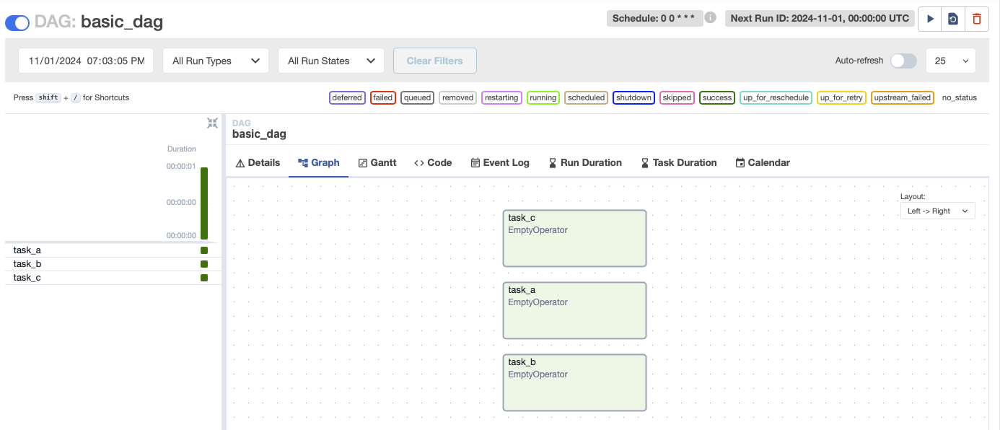
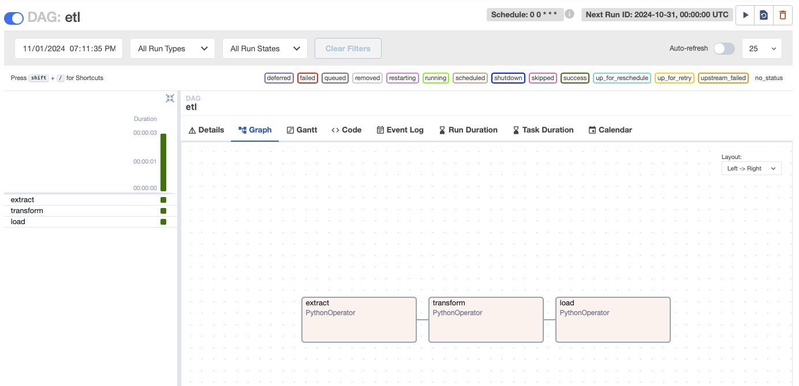

# Overview

DAG Factory ([`dag-factory`](https://github.com/astronomer/dag-factory)) is an open-source library used to define DAGs 
via configuration files. Leveraging this tools allows for data teams to author DAGs in a declarative manner and easily 
migrate workloads from legacy systems in an efficient and scalable way. In this guide, we’ll outline the key steps to 
writing DAGs with DAG Factory and explore how this tool enables bulk DAG creation without introducing code sprawl or 
having to write extensive code.


### What You'll Learn

- How to author DAGs using DAG Factory and YAML files.
- How to use Airflow-provider packages, as well as user-defined functions to instantiate DAGs using YAML.
- How to dynamically-generate YAML files using a single template file.


### What You'll Need

To get started with this project, you'll need the following:

- The [`astro`](https://www.astronomer.io/docs/astro/cli/install-cli) CLI
- Docker Desktop
- Your favorite IDE/text editor


## Getting Started

To pull this code down onto your local machine, create a new directory and run the command `git clone XXXX`. To spin up 
your own local instance of this project, run `astro dev start`. This will spin up an instance of Airflow on your 
machine, available via `localhost:8080`.

There are two packages needed to get started with this project, which are both listed in your `requirements.txt` file. 
The first is `dag-factory`, which will be used to define DAGs using YAML. The second is `PyYAML`, which we'll use in 
`include/scripts/generate_dynamic_dag.py` script to dynamically create YAML file using a template. You don't have to 
install these locally; running `astro dev start` will do so in your Docker containers.

Awesome, let's get started!


### Building a Basic DAG

Authoring a DAG with DAG Factory requires two files; a `.yml` file, and `.py` file. The `.yml` file contains things
like a DAG ID, start date, schedule interval, as well as Task definitions and their dependencies. This is the 
information that will be used to generate your DAG. The `.py` file reads this YAML file, and generates the resulting 
DAG.

In the `dags/` directory, we've defined DAG using the `basic_dag.yml` and `basic_dag.py` files. This DAG is quite 
simple; it has three Tasks (`extract`, `transform`, and `load`) each implemented with the `EmptyOperator`. The syntax 
of the YAML file might feel quite similar to defining a DAG using the `with()` context manager in Python.

```yaml
basic_etl:
  default_args:
    start_date: "2024-01-01"
  schedule_interval: "0 0 * * *"
  catchup: False
  tasks:
    task_a:
      operator: airflow.operators.empty.EmptyOperator
    task_b:
      operator: airflow.operators.empty.EmptyOperator
    task_c:
      operator: airflow.operators.empty.EmptyOperator
```

Once the YAML file has been populated, we'll need a `.py` file to make sure the DAG is generated. This code is mostly 
boilerplate, and will remain the same for almost all DAGs authored using DAG Factory. Here's what that looks like the 
code snippet below. Typically, the only thing that will change from DAG-to-DAG will be the file path pass to 
`DagFactory()`.

```python
from dagfactory import DagFactory

# Pass in an exact config file name
dag_factory: DagFactory = DagFactory("/usr/local/airflow/dags/basic_dag.yml")

# Clean and generate DAGs
dag_factory.clean_dags(globals())
dag_factory.generate_dags(globals())
```

That's it! In just four lines of Python, and a little bit of JSON, you've authored a DAG using DAG Factory. When you 
open your local instance of Airflow, you'll see a graph view that looks like the snip below. Now, you can interact with 
this DAG just like you would any other.

# TODO: Add more here.



### Building an ETL Pipeline

The DAG we created above was quite simple; it contained only three tasks, each of which were `EmptyOperator`'s that ran
in parallel. Just like with traditional DAG authoring, we can use tools like the `PythonOperator`. To do this, we'll 
need to first define "callables". These are functions that we'll eventually pass to `python_callable` to be executed.

For this tutorial, you'll use quite simple Python functions as "callables". These are stored in the 
`inlucde/etl_helpers.py` file, shown below. Note that `transform_helper` and `load_helper` both take at least one 
parameter, which we'll take a closer look at shortly.

```python
def extract_helper():
    pass


def transform_helper(ds_nodash):
    print(f"ds_nodash: {ds_nodash}")


def load_helper(database_name, table_name):
    print(f"database_name: {database_name}, table_name: {table_name}")
```

Like before, we'll also go ahead and create a new YAML file. This time, there's a little bit more complexity than 
before. Here, we're using the `PythonOperator`, which takes parameters. These include the `python_callable_name`, and 
the `python_callable_file`. The `transform` and `load` tasks also take the parameter `op_kwargs` where we pass in the 
`ds_nodash` templated field and the `database_name` and `table_name`, respectively.

If you look closely, we're also setting dependencies between tasks. The `transform` task won't execute until the
`extract` task successfully completes, and the `load` is dependent on `transform`.

```yaml
etl:
  default_args:
    start_date: "2024-01-01"
  schedule_interval: "0 0 * * *"
  catchup: False
  tasks:
    extract:
      operator: airflow.operators.python.PythonOperator
      python_callable_name: extract_helper
      python_callable_file: /usr/local/airflow/include/etl_helpers.py
    transform:
      operator: airflow.operators.python.PythonOperator
      python_callable_name: transform_helper
      python_callable_file: /usr/local/airflow/include/etl_helpers.py
      op_kwargs:
        ds_nodash: "{{ds_nodash}}"
      dependencies:
        - extract
    load:
      operator: airflow.operators.python.PythonOperator
      python_callable_name: load_helper
      python_callable_file: /usr/local/airflow/include/etl_helpers.py
      op_kwargs:
        database_name: "DE"
        table_name: "raw"
      dependencies:
        - transform
```


The `etl.py` file will look quite similar to the `basic_dag.py` file from the previous DAG. This time, it will point to 
the new `etl.yaml` file we created above. The result is a DAG that looks something like this!




### Dynamically-Generating DAGs Using Templating

Fantastic! Now that we've mastered creating DAGs using DAG Factory, we're going to try to do something a little more 
difficult; generating DAGs dynamically. To do this, we'll be using three files:

- `include/scripts/template.yml`
- `include/scripts/generate_dynamic_dag.py`
- `dags/dynamic_etl.py`

The `template.yml` file looks very similar to the `etl.yml` file from above. However, you'll see a few places where 
these two files are different. In `template.yml`, there are three fields that are denoted as templated using `<< >>`. 
These include the `dag_id`, as well as the values being passed to the `database_name` and `table_name` keys. This is a 
very common pattern for teams looking to use a single DAG configuration to spawn similar (but slightly different) DAGs.

```yaml
<< dag_id >>:
  default_args:
    start_date: "2024-01-01"
  schedule_interval: "0 0 * * *"
  catchup: False
  tasks:
    extract:
      operator: airflow.operators.python.PythonOperator
      python_callable_name: extract_helper
      python_callable_file: /usr/local/airflow/include/etl_helpers.py
    transform:
      operator: airflow.operators.python.PythonOperator
      python_callable_name: transform_helper
      python_callable_file: /usr/local/airflow/include/etl_helpers.py
      op_kwargs:
        ds_nodash: "{{ds_nodash}}"
      dependencies:
        - extract
    load:
      operator: airflow.operators.python.PythonOperator
      python_callable_name: load_helper
      python_callable_file: /usr/local/airflow/include/etl_helpers.py
      op_kwargs:
        database_name: "<< database_name >>"
        table_name: "<< table_name >>"
      dependencies:
        - transform
```

Next, we need a way to inject value to these variables. We'll do that using the `generate_dynamic_dag.py` script in 
the `include/scripts/` directory. This script uses the list of dictionaries in the `TEMPLATE_VARIABLES` object below to
inject parameters into the template. You can use this script for almost any template that you'd like to inject 
parameters into. To do this, make sure to update name of the template file that is being read from, as well as the 
target YAML file that the resulting configuration is being written to. Once these have been injected, a new file will 
be written into the DAGs directory. This file has name `dynamic_etl.py`, and contains the configuration for three DAGs. 
It's quite long, so it's not included here. 

```python
...

# Update the template file with the variables
TEMPLATE_VARIABLES: list = [
    {
        "<< dag_id >>": "business_analytics",
        "<< database_name >>": "BA",
        "<< table_name >>": "inventory"
    }, {
        "<< dag_id >>": "data_science",
        "<< database_name >>": "DS",
        "<< table_name >>": "daily_sales"
    }, {
        "<< dag_id >>": "machine_learning",
        "<< database_name >>": "ML",
        "<< table_name >>": "training_data"
    }
]

...
```

Using a single template file, we now have spawned three DAGs each with the same tasks, but different parameters passed
to those tasks. Your DAGs view in Airflow should now look a little something like the view below.


Congrats! Using DAG Factory, you've written a script to dynamically-generate DAGs using a single template! 


## Resources

- https://www.astronomer.io/docs/learn/dag-factory
- https://github.com/astronomer/dag-factory
- https://registry.astronomer.io/providers/apache-airflow/versions/latest/modules/pythonoperator
